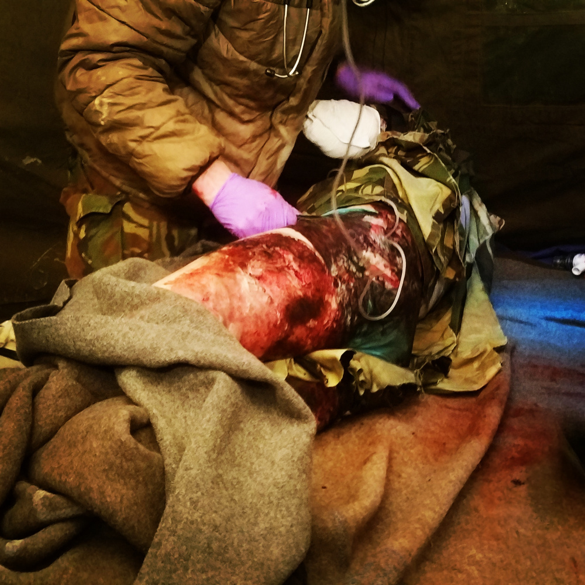

# medical-sim-cases
Simulation cases for medical training (written in MarkDown)

----

# MassCal Cases

## Case 1
### Background
The patient was relatively close to the nuclear detonation. He has thermal burns (40% TBSA) and had a significant radiation exposure (no contamination).

Estimated radiation dose: 400 rem

Burn symptoms are mixed with acute radiation syndrome.

This patient is critically ill.

Treatment Requirements:
  * Fluid resuscitation according to the Burn CPG
  * Baseline lymphocyte count

### EMS Report

The patient is a 28 year-old male who was within 2 kilometers of the blast. He has significant burns to an estimated 40% TBSA. He was vomiting on scene.

IO established right humerus.

Intubated with 8.0 ETT, 23 cm at the teeth. Induced with 250 mg ketamine and paralyzed with 40 mg rocuronium.

Total fluids 800 mL normal saline.

Current vitals are pulse 115, BP 135/80, respirations 14 bagged, pulse ox 100%.

## Case 2

# CCATT Cases
